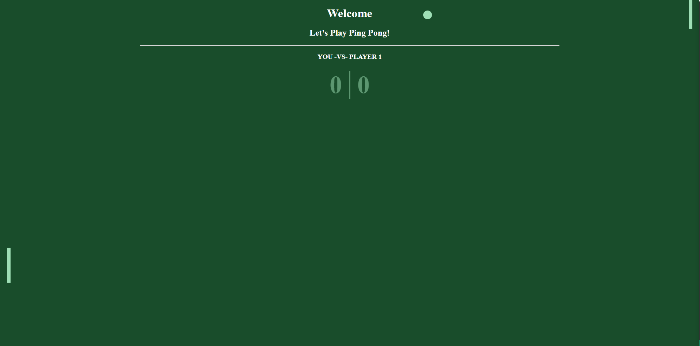

# Ping Pong 

## Table of contents

- [Overview](#overview)
  - [The challenge](#the-challenge)
  - [Screenshot](#screenshot)
  - [Links](#links)
- [My process](#my-process)
  - [Built with](#built-with)
  - [What I learned](#what-i-learned)
  - [Continued development](#continued-development)
  - [Useful resources](#useful-resources)

## Overview
Created a ping pong game with Javascript

### The challenge

Users should be able to:

-

### Screenshot

### Links

- Solution URL: https://github.com/Jud1th1/pingpong
- Live Site URL: 

## My process
-	

### Built with

- HTML
- CSS 
- Javascript

### What I learned

-	

### Continued development
-	

### Useful resources

- 

